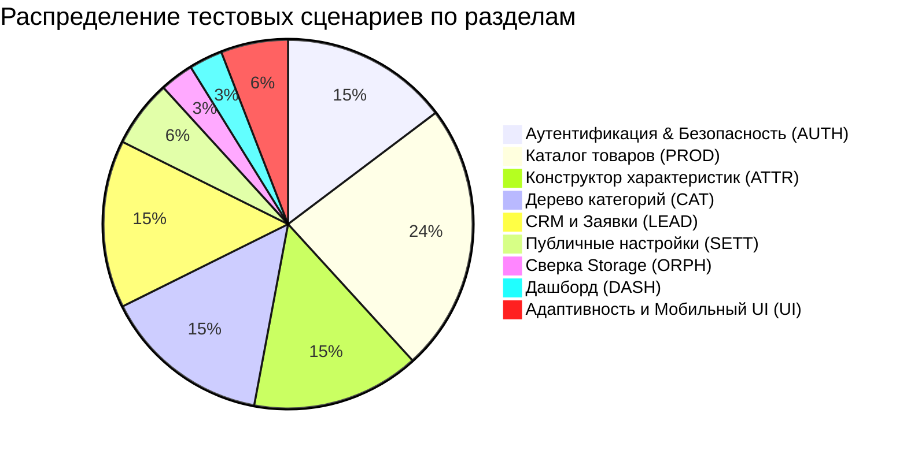

# Сводная информация по тест-плану административной панели Tehnosklad

Краткое резюме стратегии E2E-тестирования административной панели на базе **Playwright**, спроектированной на основании исходного кода, базы данных PostgreSQL, RPC-функций и интерфейса платформы **Tehnosklad**.

---

## 1. Метрики и объем покрытия

| Параметр                       | Значение | Описание                                                                             |
| ------------------------------ | :------: | ------------------------------------------------------------------------------------ |
| **Всего тестовых сценариев**   |  **34**  | Охватывают 100% реальных разделов и операций бэк-офиса                               |
| **Критический приоритет (P0)** |  **17**  | Базовые сценарии: Auth, RBAC, Categories, Attributes, Products, Leads                |
| **Высокий приоритет (P1)**     |  **9**   | CRM-экспорт, настройки магазина, сверка Storage Orphans, мобильное меню, метрики     |
| **Средний приоритет (P2)**     |  **8**   | Граничные условия, триггеры целостности, защита от циклов, дубликаты                 |
| **Сквозных E2E Flow**          |  **1**   | Полный жизненный цикл от входа и создания каталога до витрины и CRM                  |
| **Функциональных областей**    |  **9**   | Auth, Dashboard, Categories, Attributes, Products, Leads, Settings, Media, Mobile UI |

---

## 2. Распределение сценариев по разделам (Coverage Overview)



---

## 3. Ключевые сценарии по модулям

### 🔐 1. Аутентификация и безопасность (5 сценариев)

- **`AUTH-01` [P0]**: Успешный вход через Server Action `signInAdmin` с получением HTTP-only сессионных кук `@supabase/ssr`.
- **`AUTH-02` [P0]**: Блокировка неверного пароля с единым безопасным алертом (User Enumeration Protection).
- **`AUTH-03` [P0]**: Отказ авторизованному пользователю без роли `admin` или с `is_active = false` (`private.is_admin()`).
- **`AUTH-04` [P0]**: Защита прямых ссылок `/admin/*` с сохранением точки возврата `?next=<path>`.
- **`AUTH-05` [P1]**: Завершение сессии (Logout) с очисткой кук и запретом возврата назад через историю браузера.

### 📁 2. Дерево категорий (5 сценариев)

- **`CAT-01` [P0]**: Создание двуязычного черновика (RU/RO названия, слаги, описания, presentation key).
- **`CAT-02` [P0]**: Загрузка и замена обложки категории в Supabase Storage (`category-images`).
- **`CAT-03` [P0]**: Публикация с проверкой иерархии (триггер `validate_category_tree_publication`).
- **`CAT-04` [P0]**: Архивирование и восстановление с блокировкой при наличии активных товаров.
- **`CAT-05` [P2]**: Защита от циклических зависимостей (триггер `validate_category_parent_cycle`).

### ⚙️ 3. Конструктор характеристик (5 сценариев)

- **`ATTR-01` [P0]**: Создание групп характеристик с двуязычными названиями.
- **`ATTR-02` [P0]**: Поддержка всех 6 типов данных: `text`, `number`, `boolean`, `single_select`, `multi_select`, `color`.
- **`ATTR-03` [P0]**: Управление вариантами (Options) для Select-типов и защита используемых опций.
- **`ATTR-04` [P0]**: Привязка к категории с настройкой `is_required`, `is_filterable` и порядка сортировки.
- **`ATTR-05` [P2]**: Неизменяемость типа атрибута при наличии значений и запрет текстовых канонических фильтров.

### 📦 4. Каталог товаров (8 сценариев)

- **`PROD-01` [P0]**: Создание черновика, валидация цен в minor units (`MDL * 100`) и генерация слагов.
- **`PROD-02` [P0]**: Заполнение значений 6 типов атрибутов в `ProductAttributesForm`.
- **`PROD-03` [P0]**: Галерея изображений: назначение главного фото, Alt RU/RO, двухфазное удаление (`deletion_pending_at`).
- **`PROD-04` [P0]**: Прохождение чеклиста публикации (4/4 `✓`) и валидация триггера `assert_product_publishable`.
- **`PROD-05` [P0]**: Защищенный предпросмотр черновика `/admin/products/[id]/preview/ru` и `/preview/ro`.
- **`PROD-06` [P0]**: Публикация, смена наличия (`in_stock` / `out_of_stock`), изменение цен и архивация.
- **`PROD-07` [P1]**: Полнотекстовый поиск по SKU/названию и фильтры каталога.
- **`PROD-08` [P2]**: Негативная валидация цен (`old_price <= price`, отрицательные значения, невалидная дробность).

### ✉️ 5. CRM и обработка заявок (5 сценариев)

- **`LEAD-01` [P0]**: Иммутабельный снимок товара в заказе (фиксация цены и названия на момент покупки).
- **`LEAD-02` [P0]**: Жизненный цикл статуса (`new` -> `in_progress` -> `contacted` -> `closed` / `spam`) с аудитом в `lead_status_history`.
- **`LEAD-03` [P0]**: Мониторинг Telegram delivery и ручной повтор с обязательным подтверждением риска при `manual_review`.
- **`LEAD-04` [P1]**: Безопасный экспорт в CSV с защитой от Formula Injection (экранирование `=`, `+`, `-`, `@`).
- **`LEAD-05` [P1]**: Серверная фильтрация журнала лидов (статусы, источники, даты).

### 🛠️ 6. Дополнительные модули (6 сценариев)

- **`SETT-01` [P1]**: Атомарное сохранение 7 пар публичных настроек сайта (RU/RO) с инвалидацией кэша витрины.
- **`SETT-02` [P2]**: Блокировка сохранения неразрешенных ключей настроек.
- **`ORPH-01` [P1]**: Сверка бакета `product-images` с таблицей `product_images` и устранение расхождений.
- **`DASH-01` [P1]**: Сверка счетчиков дашборда с базой данных и быстрые переходы.
- **`UI-01` [P1]**: Адаптивный мобильный Drawer 375px (кнопка `☰`, крестик `×`, backdrop, `Escape`).
- **`UI-02` [P2]**: Индикация счетчиков символов у полей ввода.

---

## 4. Главный сквозной сценарий (Critical Happy-Path E2E Flow)

```
[1. Вход Admin] → [2. Создание Категории RU/RO] → [3. Создание Группы и Характеристики]
       ↓
[4. Привязка Характеристики (is_required=true)] → [5. Загрузка Обложки и Публикация Категории]
       ↓
[6. Создание Товара-черновика] → [7. Заполнение 6 типов атрибутов и фото с Alt RU/RO]
       ↓
[8. Чеклист готовности (4/4 ✓)] → [9. Защищенный Preview RU/RO] → [10. Публикация Товара]
       ↓
[11. Проверка на витрине /ru] → [12. Оформление заявки] → [13. Обработка в CRM (new→closed)]
       ↓
[14. Архивирование Товара и Категории]
```

---

## 5. Стратегия тестовых данных и изоляция

- **Локальная среда**: Все тесты запускаются строго против локального Supabase стека (`http://127.0.0.1:54321` / DB port `54322`).
- **Уникальность записей**: Каждому запуску присваивается уникальный `RUN_ID` (префиксы `E2E-${RUN_ID}`).
- **Сессионная оптимизация**: Сохранение авторизованной сессии в `playwright/.auth/admin.json` для переиспользования в защищенных тестах.
- **Очистка данных (Teardown)**: Каскадная очистка созданных сущностей в `afterAll` через Service Role Client с соблюдением порядка внешних ключей.

---

## 6. Gaps и ограничения

1. **Внешний Telegram API**: локально проверяется очередь и UI-механизм повтора, но реальная доставка пушей требует ручной верификации на staging с валидным bot-токеном.
2. **Сессионный TTL**: долговременное автообновление сессии через 1+ час требует синтетического сдвига таймеров.
3. **Визуальная верстка фотоконтента**: эстетика реальных баннеров на Retina-экранах остается задачей ручного регресса контент-менеджера.
4. **Нагрузка (10 000+ товаров)**: функциональные тесты проводятся на базовом сиде (105 товаров); нагрузочное тестирование выносится в k6/autocannon.

---

## 7. Порядок реализации тестов (Roadmap)

1. **Этап 1**: Инфраструктура `playwright.config.ts`, глобальный Auth Setup и тестовые хелперы.
2. **Этап 2**: Тесты аутентификации и безопасности (`e2e/admin-auth.spec.ts` — `AUTH-01..05`).
3. **Этап 3**: Тесты категорий и обложек (`e2e/admin-categories.spec.ts` — `CAT-01..05`).
4. **Этап 4**: Тесты характеристик и вариантов (`e2e/admin-attributes.spec.ts` — `ATTR-01..05`).
5. **Этап 5**: Тесты каталога товаров (`e2e/admin-products.spec.ts` — `PROD-01..08`).
6. **Этап 6**: Тесты CRM заявок и Telegram (`e2e/admin-leads.spec.ts` — `LEAD-01..05`).
7. **Этап 7**: Тесты настроек и Storage Orphans (`e2e/admin-settings-orphans.spec.ts` — `SETT-01..02`, `ORPH-01`).
8. **Этап 8**: Негативные тесты и мобильная верстка (`e2e/admin-negative-ui.spec.ts` — `UI-01..02`).
