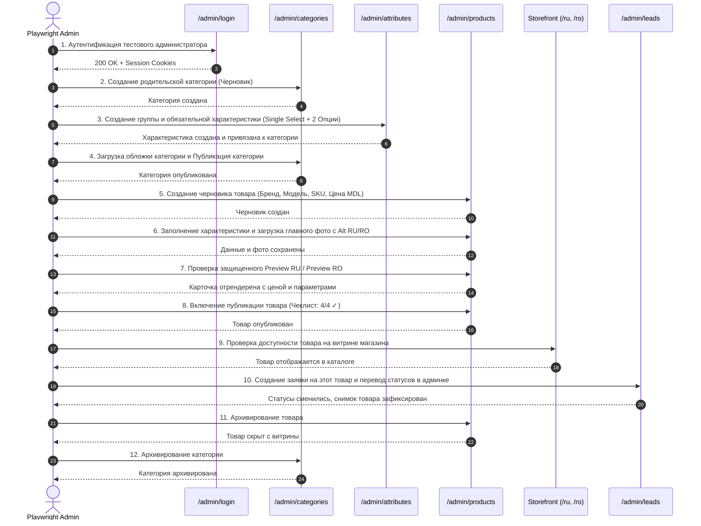

# Комплексный план тестирования административной панели Tehnosklad (Admin Test Plan)

Документ описывает полную стратегию E2E и интеграционного тестирования административной панели **Tehnosklad** на базе **Playwright**, разработанную на основе результатов глубокого исследования архитектуры, схемы PostgreSQL, бизнес-логики Server Actions и интерфейса приложения.

---

## 1. Functional Coverage (Функциональное покрытие)

| Функциональная область               | Что проверяется                                                                                                                                                                                                  | Обоснование важности                                            | Приоритет |                                           Автоматизация (E2E)                                           |                           Ручное тестирование                            |
| ------------------------------------ | ---------------------------------------------------------------------------------------------------------------------------------------------------------------------------------------------------------------- | --------------------------------------------------------------- | :-------: | :-----------------------------------------------------------------------------------------------------: | :----------------------------------------------------------------------: |
| **1. Аутентификация и безопасность** | Вход по email/паролю, валидация сессии, роли `admin`, блокировка неавторизованных запросов, защита от перечисления пользователей, logout                                                                         | Критический контур защиты бэк-офиса и клиентских данных         |  **P0**   |             **Полная**: вход, отказ не-админу, отказ при неверном пароле, редиректы, логаут             |         Проверка поведения при истечении TTL токена через N дней         |
| **2. Дашборд и метрики**             | Сводные счетчики (товары, публикации, наличие, категории, заявки, ошибки Telegram), быстрые ссылки, блок последних заявок                                                                                        | Быстрый контроль состояния магазина для оператора               |  **P1**   |          **Базовая**: проверка соответствия счетчиков реальным данным в БД, переход по ссылкам          |            Визуальная оценка верстки на сверхшироких экранах             |
| **3. Дерево категорий**              | Создание RU/RO черновиков, загрузка обложек, валидация слагов, иерархия родитель-потомок, публикация с зависимостями, архивация                                                                                  | Базовая структура каталога; ошибка ломает навигацию витрины     |  **P0**   |                 **Полная**: CRUD, публикация, архивация, проверка отложенных триггеров                  |           Художественная оценка отображения обложек на витрине           |
| **4. Конструктор характеристик**     | Группы характеристик, 6 типов данных (`text`, `number`, `boolean`, `single_select`, `multi_select`, `color`), варианты (Options), привязка к категориям (`required`/`filterable`), защита неизменяемости типов   | Определяет фильтрацию и параметры всех товаров каталога         |  **P0**   | **Полная**: создание групп, типов, опций, привязок к категориям, проверка запрета удаления используемых |       Удобство перетаскивания (drag-and-drop), если будет внедрен        |
| **5. Каталог товаров**               | Черновики, заполнение всех 6 типов атрибутов, загрузка/сортировка фото с Alt RU/RO, двухфазное удаление, чеклист публикации, предпросмотр RU/RO, публикация, смена цен и наличия, архивация                      | Основная бизнес-сущность магазина и источник дохода             |  **P0**   |       **Полная**: полный жизненный цикл, чеклист, фото, предпросмотр, публикация, поиск, фильтры        |        Ручная оценка читаемости маркетинговых текстов в Markdown         |
| **6. CRM и обработка заявок**        | Журнал лидов, фильтры, поиск, иммутабельный снимок товара, переходы статусов (`new` -> `in_progress` -> `contacted` -> `closed`/`spam`), аудит истории, мониторинг Telegram-доставки, ручной повтор, CSV-экспорт | Главная воронка конверсии сайта; риск потери заказов            |  **P0**   |   **Полная**: смена статусов, запись в историю, логика Telegram retry с чекбоксом риска, экспорт CSV    |        Реальный прием сообщения на физическом телефоне в Telegram        |
| **7. Публичные настройки**           | Атомарное сохранение 7 фиксированных пар настроек (RU/RO), мгновенная инвалидация кэша витрины                                                                                                                   | Актуальность контактов, телефонов и часов работы магазина       |  **P1**   |           **Полная**: редактирование телефонов, адреса, графиков работы, проверка на витрине            |     Проверка набора номера при клике на `tel:` на реальном смартфоне     |
| **8. Целостность Storage (Orphans)** | Сканирование бакета `product-images`, сверка с таблицей `product_images`, очистка orphan-файлов и битой метадаты                                                                                                 | Предотвращение утечек диска и битых изображений в карточках     |  **P1**   |         **Полная**: проверка пустого состояния, выявление и устранение тестовых orphan-записей          |           Массовая очистка тысяч файлов под высокой нагрузкой            |
| **9. Адаптивность и UX**             | Мобильный drawer (`☰`, `×`, backdrop, `Escape`), счетчики символов у лимитов, единая высота полей ввода, алерты `?saved=1` и `?error=<code>`                                                                    | Удобство и надежность работы оператора на мобильных устройствах |  **P1**   |              **Полная**: открытие/закрытие меню на мобильных вьюпортах, проверка баннеров               | Тактильный отклик и плавность анимаций на реальных мобильных устройствах |

---

## 2. Test Scenarios (Спецификация тестовых сценариев)

### Группа 1: Аутентификация и безопасность (AUTH)

#### `AUTH-01` [P0] Успешная аутентификация администратора через UI

- **Preconditions**: В локальной базе существует активный пользователь с `role = 'admin'` (`admin.e2e@test.local`).
- **Test Data**: Валидные email и пароль тестового администратора.
- **Steps**:
  1. Перейти на `http://localhost:3000/admin/login`.
  2. Заполнить поле «Email» значением `admin.e2e@test.local`.
  3. Заполнить поле «Пароль» валидным тестовым паролем.
  4. Нажать кнопку «Войти».
- **Expected Result**:
  - HTTP 303 Redirect на `/admin`.
  - Страница `/admin` отрендерилась со статусом 200.
  - В шапке отображается email `admin.e2e@test.local` и кнопка «Выйти».
  - В браузере установлены сессионные cookies Supabase Auth.
- **What is verified**: Корректность работы Server Action `signInAdmin`, генерация SSR сессии и авторизационный гард `requireAdmin()`.

#### `AUTH-02` [P0] Отказ при неверном пароле или несуществующем email

- **Preconditions**: Локальное приложение запущено.
- **Test Data**: Несуществующий email (`wrong.admin@test.local`) / неверный пароль.
- **Steps**:
  1. Перейти на `/admin/login`.
  2. Ввести email и заведомо неверный пароль.
  3. Отправить форму.
- **Expected Result**:
  - Пользователь остается на `/admin/login?error=credentials`.
  - Отображается алерт об ошибке: «Вход не выполнен. Проверьте данные и наличие активной роли администратора.».
  - Сессионные cookies не созданы.
- **What is verified**: Защита от подбора паролей, отсутствие раскрытия существования пользователя (User Enumeration).

#### `AUTH-03` [P0] Блокировка доступа для пользователя без роли `admin` или с `is_active = false`

- **Preconditions**: В базе создан пользователь без записи в `user_roles` или с `profiles.is_active = false`.
- **Test Data**: Credentials не-администратора (`user.regular@test.local`).
- **Steps**:
  1. Войти под учетной записью обычного пользователя на `/admin/login`.
- **Expected Result**:
  - Вход отклонен с сообщением `error=credentials`.
  - Доступ к `/admin` заблокирован.
- **What is verified**: Проверка условия `private.is_admin()` в `guard.ts` и в PostgreSQL RPC.

#### `AUTH-04` [P0] Защита прямых маршрутов бэк-офиса от неавторизованного доступа

- **Preconditions**: Пользователь не авторизован (cookies отсутствуют).
- **Test Data**: Нет.
- **Steps**:
  1. Выполнить прямой переход на `/admin`, `/admin/categories`, `/admin/products/new`, `/admin/leads`, `/admin/settings`.
- **Expected Result**:
  - Моментальный редирект (HTTP 307/303) на `/admin/login?next=<encoded_path>`.
  - Содержимое защищенных страниц не попадает в HTML-ответ.
- **What is verified**: Работа Next.js Middleware (`src/proxy.ts`) и Server Component Layout Guard (`requireAdmin()`).

#### `AUTH-05` [P1] Завершение сессии (Logout)

- **Preconditions**: Администратор авторизован и находится в `/admin`.
- **Steps**:
  1. Нажать кнопку «Выйти» в шапке панели.
- **Expected Result**:
  - Сессия аннулируется на сервере.
  - Редирект на `/admin/login`.
  - Повторная попытка нажать кнопку «Назад» в браузере не открывает защищенные данные благодаря `Cache-Control: private, no-store`.
- **What is verified**: Работа Server Action `signOutAdmin` и очистка cookies.

---

### Группа 2: Дашборд и обзор (DASH)

#### `DASH-01` [P1] Проверка метрик дашборда и быстрых переходов

- **Preconditions**: В локальной базе присутствуют тестовые категории, товары и заявки.
- **Steps**:
  1. Открыть `/admin`.
  2. Сравнить значения карточек «Всего товаров», «Опубликовано», «Нет в наличии», «Категории», «Новые заявки», «Ошибки Telegram» с данными в БД.
  3. Кликнуть по каждой карточке.
- **Expected Result**:
  - Карточки отображают точные счетчики.
  - Клики ведут на соответствующие фильтры (`/admin/products?publication=published`, `/admin/leads?status=new` и т.д.).
- **What is verified**: Агрегирующие SQL-запросы в `getAdminDashboardSummary`.

---

### Группа 3: Управление категориями (CAT)

#### `CAT-01` [P0] Создание двуязычной категории (Черновик)

- **Preconditions**: Администратор авторизован.
- **Test Data**: Уникальный суффикс (e.g. `test-${RUN_ID}`), RU/RO названия, слаги (`test-cat-ru`, `test-cat-ro`).
- **Steps**:
  1. Перейти на `/admin/categories/new`.
  2. Выбрать `presentation_key = generic`, `sort_order = 15`.
  3. Заполнить RU: название, slug, краткое и полное описание, SEO title/description.
  4. Заполнить RO: аналогичный набор полей.
  5. Снять чекбокс «Опубликована» (создание черновика).
  6. Нажать «Сохранить категорию».
- **Expected Result**:
  - Редирект на `/admin/categories/[new_uuid]?saved=1`.
  - Отображается баннер «Изменения сохранены».
  - В списке `/admin/categories` появилась новая категория со статусом «Черновик».
- **What is verified**: Валидация `saveCategoryAction`, вызов RPC `admin_save_category`, вставка в `categories` и `category_translations`.

#### `CAT-02` [P0] Загрузка и замена обложки категории

- **Preconditions**: Создана тестовая категория на шаге `CAT-01`.
- **Test Data**: Валидный файл изображения WebP/JPEG (размер < 5 МБ).
- **Steps**:
  1. Открыть карточку категории `/admin/categories/[id]`.
  2. В блоке «Изображение категории» выбрать файл и нажать «Загрузить изображение».
- **Expected Result**:
  - Страница обновляется с параметром `?saved=1`.
  - Отображается превью загруженного изображения.
  - В БД `categories.image_storage_path` содержит путь `categories/<uuid>.<ext>`.
  - Файл физически доступен в бакете `category-images`.
- **What is verified**: `uploadCategoryImageAction`, валидация magic bytes файла, сохранение в Supabase Storage.

#### `CAT-03` [P0] Публикация категории и проверка иерархии

- **Preconditions**: Создана родительская категория и дочерняя категория.
- **Steps**:
  1. Попытаться опубликовать дочернюю категорию, когда родитель — черновик.
  2. Проверить отказ базы данных.
  3. Опубликовать родительскую категорию, затем дочернюю.
- **Expected Result**:
  - Попытка публикации дочерней при неопубликованном родителе блокируется ошибкой `Published category requires published parent`.
  - После публикации родителя публикация дочерней проходит успешно.
- **What is verified**: Триггер `validate_category_tree_publication`.

#### `CAT-04` [P0] Архивирование и восстановление категории

- **Preconditions**: Существует опубликованная категория без товаров и подкатегорий.
- **Steps**:
  1. В карточке категории нажать «Архивировать категорию» и подтвердить в диалоге.
  2. Проверить статус: «Архив», `is_published = false`.
  3. Нажать «Восстановить категорию».
  4. Проверить статус: «Черновик».
- **Expected Result**:
  - Атомарная смена `archived_at` и принудительный сброс публикации при архивации.
  - При наличии активных товаров архивация блокируется ошибкой `category_in_use`.
- **What is verified**: RPC `admin_set_category_archived`.

#### `CAT-05` [P2] Защита от циклических зависимостей в дереве категорий

- **Preconditions**: Категория A является родителем категории B.
- **Steps**:
  1. Открыть категорию A и попытаться установить в качестве родителя категорию B.
- **Expected Result**:
  - Операция отклоняется с ошибкой `category_parent_cycle` («Категория не может быть собственным потомком»).
- **What is verified**: Рекурсивный триггер `validate_category_parent_cycle`.

---

### Группа 4: Конструктор характеристик (ATTR)

#### `ATTR-01` [P0] Создание группы характеристик

- **Preconditions**: Администратор авторизован.
- **Test Data**: Код `tech_specs_${RUN_ID}`, RU/RO названия («Технические характеристики» / «Specificații tehnice»).
- **Steps**:
  1. Перейти на `/admin/attribute-groups/new`.
  2. Заполнить код, порядок и переводы RU/RO.
  3. Нажать «Сохранить группу».
- **Expected Result**:
  - Редирект на карточку группы `?saved=1`.
  - Группа отображается в списке `/admin/attribute-groups`.
- **What is verified**: RPC `admin_save_attribute_group`.

#### `ATTR-02` [P0] Создание характеристик всех 6 типов данных

- **Preconditions**: Создана тестовая группа характеристик.
- **Steps**:
  1. Создать характеристику `text` (текстовая).
  2. Создать характеристику `number` с единицей измерения `unit_code = 'kg'`.
  3. Создать характеристику `boolean` (логическая).
  4. Создать характеристику `single_select` (одиночный выбор).
  5. Создать характеристику `multi_select` (множественный выбор).
  6. Создать характеристику `color` (цвет).
- **Expected Result**:
  - Все 6 характеристик успешно создаются с переводами RU/RO.
  - В списке `/admin/attributes` отображаются соответствующие бейджи типов.
- **What is verified**: Валидация типов `AdminAttributeDataType`, RPC `admin_save_attribute`.

#### `ATTR-03` [P0] Управление вариантами (Options) для Select-характеристик

- **Preconditions**: Создана характеристика типа `single_select`.
- **Steps**:
  1. Открыть карточку характеристики `/admin/attributes/[id]`.
  2. В блоке «Варианты» ввести код `opt_a`, порядок `10`, RU «Вариант А», RO «Varianta A» и нажать «Добавить вариант».
  3. Добавить второй вариант `opt_b`.
  4. Отредактировать название варианта `opt_a`.
  5. Удалить вариант `opt_b`.
- **Expected Result**:
  - Варианты сохраняются в `attribute_options` и `attribute_option_translations`.
  - Удаление неиспользуемого варианта проходит успешно.
  - Удаление используемого в товарах варианта блокируется ошибкой `attribute_option_in_use`.
- **What is verified**: `saveAttributeOptionAction`, `deleteAttributeOptionAction`.

#### `ATTR-04` [P0] Привязка характеристики к категории с настройками

- **Preconditions**: Существует тестовая категория и созданная характеристика.
- **Steps**:
  1. В карточке характеристики в блоке «Категории» выбрать категорию из выпадающего списка.
  2. Установить чекбоксы `is_required = true` и `is_filterable = true`.
  3. Нажать «Привязать категорию».
  4. Проверить отображение привязки в таблице.
  5. Изменить флаг `is_required` на `false` и сохранить.
  6. Нажать «Отвязать».
- **Expected Result**:
  - Запись создается в `category_attributes`.
  - Изменение флагов сохраняется.
  - Отвязка категории, товары которой уже содержат значения этого атрибута, блокируется ошибкой `category_attribute_in_use`.
- **What is verified**: RPC `admin_set_category_attribute`, `admin_delete_category_attribute`.

#### `ATTR-05` [P2] Защита от смены типа характеристики и канонической фильтрации текста

- **Steps**:
  1. Попытаться изменить `data_type` у характеристики, имеющей опции или значения.
  2. Попытаться установить `is_filterable = true` для характеристики с `data_type = 'text'`.
- **Expected Result**:
  - Смена типа блокируется: `Cannot change the type of an attribute in use`.
  - Фильтрация для текста блокируется: `Text attributes cannot be canonical filters`.
- **What is verified**: Триггеры `validate_attribute_data_type_immutable` и `validate_canonical_filters`.

---

### Группа 5: Управление товарами (PROD)

#### `PROD-01` [P0] Создание черновика товара и валидация цен

- **Preconditions**: Существует опубликованная категория.
- **Test Data**: Бренд `Samsung`, модель `Test-Model-${RUN_ID}`, SKU `TS-TST-${RUN_ID}`, цена `12999`, старая цена `14999`.
- **Steps**:
  1. Перейти на `/admin/products/new`.
  2. Заполнить категорию, бренд, модель, SKU, цену `12999` MDL, старую цену `14999` MDL, наличие `in_stock`.
  3. Заполнить RU и RO названия, слаги, краткие и полные описания.
  4. Сохранить без флага публикации (`is_published = false`).
- **Expected Result**:
  - Редирект на `/admin/products/[id]?saved=1`.
  - В БД цена сохранена как `1299900` (minor units bigint), старая цена — `1499900`.
  - Товар отображается со статусом «Черновик».
- **What is verified**: Конвертация денег в minor units (`moneyToMinor`), RPC `admin_save_product`.

#### `PROD-02` [P0] Заполнение динамических характеристик товара

- **Preconditions**: Товар привязан к категории, у которой настроены атрибуты 6 типов.
- **Steps**:
  1. В карточке товара открыть блок «Характеристики».
  2. Заполнить текстовый атрибут (RU/RO строки).
  3. Заполнить числовой атрибут (`45.5`).
  4. Заполнить логический атрибут (выбрать «Да»).
  5. Выбрать вариант в `single_select`.
  6. Выбрать 2 чекбокса в `multi_select`.
  7. Ввести HEX-код цвета (`#FF5500`).
  8. Нажать «Сохранить характеристики».
- **Expected Result**:
  - Сообщение `?saved=1`.
  - В `product_attribute_values` созданы 7 записей с корректными типизированными колонками (`text_value_key`, `number_value`, `boolean_value`, `option_id`, `color_value`).
- **What is verified**: `saveProductAttributesAction`, RPC `admin_replace_product_attribute_values`.

#### `PROD-03` [P0] Загрузка изображений, Alt RU/RO, назначение главного и удаление

- **Preconditions**: Открыта карточка товара.
- **Steps**:
  1. Загрузить первое фото с Alt RU «Вид спереди» и Alt RO «Vedere din față», отметить чекбокс «Главное».
  2. Загрузить второе фото с Alt RU «Вид сбоку» и Alt RO «Vedere laterală».
  3. Сменить главное фото на второе.
  4. Удалить первое фото.
- **Expected Result**:
  - Первое фото загружено с `is_primary = true`.
  - После смены главного фото флаг атомарно перемещается на второе фото.
  - Удаление запускает двухфазный процесс: пометка `deletion_pending_at` -> удаление из Storage -> удаление строки из `product_images`.
- **What is verified**: `uploadProductImageAction`, `updateProductImageAction`, `deleteProductImageAction`, RLS-фильтр по `deletion_pending_at`.

#### `PROD-04` [P0] Чеклист готовности к публикации и валидация публикации

- **Preconditions**: Товар с незаполненными обязательными характеристиками или без alt-текстов фото.
- **Steps**:
  1. Проверить интерактивный чеклист публикации на карточке товара.
  2. Попытаться включить «Опубликован» и сохранить при наличии `×` в чеклисте.
  3. Проверить появление ошибки публикации.
  4. Устранить все замечания (заполнить обязательные поля и Alt RU/RO).
  5. Повторно включить «Опубликован» и сохранить.
- **Expected Result**:
  - Чеклист наглядно подсвечивает недостающие данные (`✓` / `×`).
  - Попытка публикации блокируется отложенным триггером `assert_product_publishable` с понятным сообщением («Заполните все обязательные характеристики» / «Для публикации категории нужны полные переводы»).
  - После устранения замечаний товар успешно переходит в статус «Опубликован».
- **What is verified**: Триггер `assert_product_publishable` и клиентский чеклист.

#### `PROD-05` [P0] Защищенный предпросмотр товара (Preview RU / Preview RO)

- **Preconditions**: Товар в статусе «Черновик» с заполненными характеристиками и фото.
- **Steps**:
  1. Нажать кнопку «Preview RU».
  2. Нажать кнопку «Preview RO».
- **Expected Result**:
  - Страницы `/admin/products/[id]/preview/ru` и `/ro` открываются с бейджем предпросмотра.
  - Отображаются корректные цены, название, галерея и характеристики на выбранном языке.
  - Доступ для неавторизованных пользователей к предпросмотру закрыт.
- **What is verified**: Маршрут `(backoffice)/admin/(protected)/products/[id]/preview/[locale]/page.tsx`.

#### `PROD-06` [P0] Управление наличием, ценами и архивация товара

- **Preconditions**: Опубликованный товар.
- **Steps**:
  1. Изменить статус наличия с `in_stock` на `out_of_stock`.
  2. Изменить цену.
  3. Нажать «Архивировать товар».
  4. Проверить сброс публикации и установку `archived_at`.
  5. Нажать «Восстановить товар как черновик».
- **Expected Result**:
  - Товар в наличии `out_of_stock` скрывается из фильтров наличия.
  - Архивированный товар исчезает с публичной витрины.
  - Восстановление возвращает товар в статус «Черновик».
- **What is verified**: RPC `admin_save_product`, `admin_set_product_archived`.

#### `PROD-07` [P1] Полнотекстовый поиск и фильтрация в каталоге товаров

- **Preconditions**: В каталоге присутствуют товары разных категорий и статусов.
- **Steps**:
  1. Ввести в поле поиска поисковый запрос по SKU (например `TS-REF`).
  2. Выбрать фильтр по категории.
  3. Выбрать фильтр публикации: «Черновик».
  4. Нажать «Применить».
- **Expected Result**:
  - Список фильтруется строго по указанным критериям.
  - Отображается счетчик найденных товаров.
- **What is verified**: Серверные фильтры в `listAdminProducts`.

---

### Группа 6: Обработка заявок и CRM (LEAD)

#### `LEAD-01` [P0] Просмотр заявки и проверка иммутабельного снимка товара

- **Preconditions**: В базе создана заявка, привязанная к товару.
- **Steps**:
  1. Открыть список `/admin/leads`.
  2. Кликнуть по заявке и перейти на `/admin/leads/[id]`.
  3. Проверить блок «Контактные данные»: телефон (ссылка `tel:`), имя, источник, язык, дата согласия.
  4. Проверить блок «Snapshot товара»: сохраненное название, цена в MDL на момент заказа, ссылка на товар.
- **Expected Result**:
  - Все контактные поля и снимок товара отображаются корректно.
  - Поля снимка защищены от изменения (Read-Only).
- **What is verified**: Карточка заявки `(protected)/leads/[id]/page.tsx`, DTO маппер `mapAdminLeadDetail`.

#### `LEAD-02` [P0] Жизненный цикл статуса заявки и аудит истории

- **Preconditions**: Заявка в статусе `new`.
- **Steps**:
  1. В выпадающем списке статусов выбрать `in_progress` и нажать «Обновить статус».
  2. Выбрать статус `contacted` и обновить.
  3. Выбрать статус `closed` и обновить.
  4. Проверить таймлайн «История статусов».
- **Expected Result**:
  - Статус заявки последовательно меняется.
  - В блоке истории фиксируются все 3 перехода с точным временем и ID администратора (`changed_by`).
- **What is verified**: Server Action `setLeadStatusAction`, триггер/таблица `lead_status_history`.

#### `LEAD-03` [P0] Мониторинг Telegram Delivery и ручной повтор с подтверждением риска

- **Preconditions**: Заявка с состоянием доставки `permanent_failure` или `manual_review`.
- **Steps**:
  1. Открыть заявку со статусом Telegram `manual_review`.
  2. Проверить лог попыток (HTTP-коды, коды ошибок).
  3. Попытаться нажать «Повторить отправку» без взвода чекбокса риска.
  4. Убедиться, что форма требует чекбокс.
  5. Отметить чекбокс «Понимаю риск дубликата» и нажать «Повторить отправку».
- **Expected Result**:
  - Состояние доставки переходит в `queued` для повторной обработки фоновым воркером.
- **What is verified**: `retryLeadTelegramDeliveryAction`, RPC `admin_retry_lead_telegram_delivery`.

#### `LEAD-04` [P1] Безопасный экспорт заявок в CSV с санитизацией формул

- **Preconditions**: В журнале заявок есть записи, в том числе имя, начинающееся с символов `=SUM(1+1)`, `+`, `-`, `@`.
- **Steps**:
  1. На странице `/admin/leads` нажать кнопку «Экспорт CSV».
  2. Скачать сгенерированный файл.
  3. Проверить содержимое CSV.
- **Expected Result**:
  - HTTP 200 с заголовками `Content-Type: text/csv; charset=utf-8` и `Content-Disposition: attachment`.
  - Ячейки, начинающиеся со спецсимволов формул, безопасно экранированы префиксом `'` (апостроф).
- **What is verified**: Route Handler `/admin/leads/export/route.ts`, защита от CSV Formula Injection.

---

### Группа 7: Публичные настройки магазина (SETT)

#### `SETT-01` [P1] Редактирование публичных настроек сайта (7 ключей)

- **Preconditions**: Администратор на странице `/admin/settings`.
- **Steps**:
  1. Изменить значение `phone_display` для RU и RO.
  2. Нажать «Сохранить настройку» для этой карточки.
  3. Изменить график работы `open_time` RU/RO и сохранить.
  4. Открыть главную страницу витрины `/ru` и `/ro`.
- **Expected Result**:
  - Настройки сохраняются в `site_settings`.
  - Срабатывает инвалидация кэша тега `settings`.
  - Обновленные контакты и график немедленно отображаются в шапке/футере витрины.
- **What is verified**: `saveSiteSettingAction`, RPC `admin_set_public_site_setting_pair`, `revalidateCatalogAfterMutation('settings')`.

---

### Группа 8: Проверка файлов и сверка Storage (ORPH)

#### `ORPH-01` [P1] Сверка Storage и устранение расхождений (Media Orphans)

- **Preconditions**: Администратор на странице `/admin/media/orphans`.
- **Steps**:
  1. Проверить статус при согласованном состоянии: «Orphan-файлов нет | Storage и metadata согласованы.».
  2. При наличии записей `orphan_object` нажать «Очистить» -> подтвердить удаление лишнего файла из бакета.
  3. При наличии записей `missing_object` нажать «Очистить» -> подтвердить удаление сломанной записи из БД.
  4. При наличии `pending_metadata` нажать «Восстановить / завершить».
- **Expected Result**:
  - Расхождения успешно устраняются.
- **What is verified**: `reconcileImageEntryAction`, `scanAdminProductOrphans`.

---

### Группа 9: Адаптивность и мобильный интерфейс (UI)

#### `UI-01` [P1] Проверка мобильной навигации и управления меню

- **Preconditions**: Вьюпорт браузера установлен в 375x667 (Mobile).
- **Steps**:
  1. Проверить видимость кнопки `☰` («Открыть навигацию»).
  2. Нажать `☰` -> проверить открытие сайдбара `aside.admin-sidebar--open`.
  3. Нажать кнопку `×` -> проверить закрытие меню.
  4. Снова открыть меню и нажать клавишу `Escape` -> проверить закрытие.
  5. Снова открыть меню и кликнуть на затемненный backdrop -> проверить закрытие.
- **Expected Result**:
  - Сайдбар плавно и корректно открывается/закрывается всеми тремя способами.
- **What is verified**: Клиентский компонент `AdminNavigationClient` (`src/components/admin/admin-navigation-client.tsx`).

---

## 3. Test Data Strategy (Стратегия тестовых данных)

```mermaid
graph TD
    subgraph Pre-existing Seed Data
        SeedCat[15 Base Categories]
        SeedProd[105 Base Products]
        SeedAttr[Base Attribute Definitions]
        SeedSettings[7 Site Settings Pairs]
    end

    subgraph Dynamic E2E Test Fixtures (Isolated per run)
        TestAdmin[Test Admin: admin.e2e@test.local]
        TestGroup[Attribute Group: e2e-grp-UUID]
        TestAttr[Attribute: e2e-attr-UUID]
        TestOption[Options: e2e-opt-UUID]
        TestCat[Category: e2e-cat-UUID]
        TestBinding[Binding: Cat + Attr]
        TestProd[Product Draft: e2e-prod-UUID]
        TestImage[Test Image: 1x1 WebP]
        TestLead[Lead: e2e-lead-UUID]
    end

    SeedCat -.-> SeedProd
    TestAdmin -->|Creates via UI| TestGroup
    TestGroup --> TestAttr
    TestAttr --> TestOption
    TestCat --> TestBinding
    TestAttr --> TestBinding
    TestBinding --> TestProd
    TestImage --> TestProd
    TestProd --> TestLead
```

### Спецификация тестовых данных

1. **Изоляция окружения**:
   - Тесты выполняются **исключительно** на локальной тестовой базе данных Supabase (`http://127.0.0.1:54321` / DB port `54322`).
   - Использование production или staging баз строго исключено.

2. **Идентификация тестовых данных (Unique Run ID)**:
   - Каждый тестовый прогон генерирует уникальный префикс: `const runId = randomUUID().slice(0, 8);`.
   - Все создаваемые сущности маркируются этим идентификатором:
     - SKU: `E2E-${runId}`
     - Slugs: `e2e-cat-${runId}-ru`, `e2e-prod-${runId}-ro`
     - Codes: `e2e_grp_${runId}`, `e2e_attr_${runId}`
     - Email лидов: `lead-${runId}@example.test`

3. **Разделение данных**:
   - **Static Base Seed**: 15 базовых категорий и 105 товаров создаются один раз при `npm run db:reset:local` и служат фоном для проверки списков и счетчиков.
   - **Dynamic Test Fixtures**: Все данные для сквозных CRUD-тестов (категории, характеристики, товары, фото, лиды) создаются непосредственно тестом через UI или через вспомогательные тестовые хелперы API, а затем очищаются в блоке `afterAll` / `afterEach`.

4. **Тестовые медиа-файлы**:
   - Минимальные валидные синтетические WebP/JPEG буферы (1x1 px, ~100 байт с корректными magic bytes `RIFF....WEBP` и `\xFF\xD8\xFF`), хранящиеся в `tests/fixtures/images/`.

---

## 4. Critical E2E Flows (Главный сквозной сценарий)

Главный сквозной happy-path сценарий (`CRITICAL-FLOW-01`) проверяет полную связку всех сущностей платформы:



---

## 5. Negative Testing (Матрица негативных проверок)

| Область           | Тестовый случай                  | Вводимые данные                                            | Ожидаемая реакция системы                                     |
| ----------------- | -------------------------------- | ---------------------------------------------------------- | ------------------------------------------------------------- |
| **Форма входа**   | Пустые поля                      | Пустой email / пустой пароль                               | HTML5 блокировка `required`, форма не отправляется            |
| **Форма входа**   | Неверный формат                  | `not-an-email`                                             | HTML5 ошибка формата `type="email"`                           |
| **Цены товара**   | Старая цена меньше новой         | `price = 1000`, `old_price = 800`                          | Ошибка валидации: `Старая цена должна быть больше текущей`    |
| **Цены товара**   | Отрицательная цена               | `price = -50`                                              | Ошибка валидации формата `moneyToMinor`                       |
| **Цены товара**   | 3 знака после запятой            | `price = 10.999`                                           | Ошибка формата (допускается не более 2 знаков)                |
| **Слаги (Slugs)** | Недопустимые символы             | `Slug с пробелом`, `кириллица`, `UPPERCASE`, `a--b`        | Блокировка регулярным выражением `^[a-z0-9]+(?:-[a-z0-9]+)*$` |
| **Слаги (Slugs)** | Дубликат слага                   | Попытка задать существующий slug в том же языке            | Ошибка уникальности `23505 duplicate key`                     |
| **Изображения**   | Превышение размера               | Файл размером 5.5 МБ                                       | Ошибка `upload_invalid` (лимит 5 МБ)                          |
| **Изображения**   | Поддельное расширение            | Файл `.exe` или `.svg`, переименованный в `.jpg`           | Ошибка проверки сигнатуры magic bytes                         |
| **Публикация**    | Отсутствие перевода              | Заполнен только RU, RO оставлен пустым                     | Ошибка отложенного триггера `assert_product_publishable`      |
| **Публикация**    | Не заполнен обязательный атрибут | Товар публикуется без обязательного атрибута категории     | Отказ триггера `missing a required attribute`                 |
| **Публикация**    | Нет alt-текстов у фото           | Картинка загружена без `alt_ru` или `alt_ro`               | Отказ триггера `images require ru and ro alt`                 |
| **Иерархия**      | Цикл в категориях                | Категория назначается родителем самой себе                 | Ошибка триггера `category_parent_cycle`                       |
| **Удаление**      | Удаление используемой сущности   | Удаление категории с товарами / группы с характеристиками  | Ошибка `category_in_use` / `attribute_group_in_use`           |
| **Настройки**     | Неразрешенный ключ               | Попытка отправить через форму `key = 'secret_admin_token'` | Ошибка безопасности `site_setting_not_allowed`                |

---

## 6. API / Backend Verification Matrix (Сверка UI и Базы данных)

Для каждой критической UI-операции тесты должны проверять не только DOM-элементы страницы, но и прямое состояние строк в локальной БД:

| UI Операция              | Вызываемый Server Action / Route  | Исполняемый PostgreSQL RPC                      | Таблицы БД для ассерта                         | Проверяемое состояние в БД                                                       |
| ------------------------ | --------------------------------- | ----------------------------------------------- | ---------------------------------------------- | -------------------------------------------------------------------------------- |
| **Создание категории**   | `saveCategoryAction`              | `admin_save_category`                           | `categories`, `category_translations`          | Строка создана, `sort_order` совпадает, ровно 2 перевода (`ru`, `ro`)            |
| **Архивация категории**  | `setCategoryArchivedAction`       | `admin_set_category_archived`                   | `categories`                                   | `archived_at is not null`, `is_published = false`                                |
| **Создание группы**      | `saveAttributeGroupAction`        | `admin_save_attribute_group`                    | `attribute_groups`, translations               | `code` совпадает, переводы сохранены                                             |
| **Привязка атрибута**    | `setCategoryAttributeAction`      | `admin_set_category_attribute`                  | `category_attributes`                          | Запись `(category_id, attribute_id)`, флаги `is_required`, `is_filterable`       |
| **Создание товара**      | `saveProductAction`               | `admin_save_product`                            | `products`, `product_translations`             | `price_minor` переведен в копейки (`* 100`), `sku` уникален, переводы созданы    |
| **Сохранение атрибутов** | `saveProductAttributesAction`     | `admin_replace_product_attribute_values`        | `product_attribute_values`, translations       | Старые значения удалены, новые типизированные колонки заполнены                  |
| **Загрузка фото товара** | `uploadProductImageAction`        | `admin_create_product_image`                    | `product_images`, `product_image_translations` | Путь `<productId>/<uuid>.<ext>`, `is_primary = true/false`, Alt RU/RO            |
| **Удаление фото товара** | `deleteProductImageAction`        | `admin_mark_product_image_deleting` -> finalize | `product_images`, Storage                      | Строка удалена из БД, файл отсутствует в бакете Storage                          |
| **Смена статуса заявки** | `setLeadStatusAction`             | `admin_set_lead_status`                         | `leads`, `lead_status_history`                 | `leads.status` обновлен, в `lead_status_history` добавлена строка с `changed_by` |
| **Повтор Telegram**      | `retryLeadTelegramDeliveryAction` | `admin_retry_lead_telegram_delivery`            | `lead_telegram_deliveries`                     | `state = 'queued'`, `available_at <= now()`                                      |
| **Сохранение настроек**  | `saveSiteSettingAction`           | `admin_set_public_site_setting_pair`            | `site_settings`                                | Ровно 2 записи на ключ (`locale in ('ru', 'ro')`) с новыми значениями            |

---

## 7. Test Isolation & Cleanup Strategy (Изоляция тестов)

1. **Отсутствие взаимного влияния (Zero Side-Effects)**:
   - Каждый тестовый файл создает свои собственные тестовые сущности с префиксом `E2E-${RUN_ID}`.
   - Тесты не полагаются на порядок запуска (Order Independent).
2. **Сессионная изоляция Playwright**:
   - Использование `test.use({ storageState: ... })` для повторного использования авторизованной сессии администратора без необходимости логиниться в каждом `it`-блоке.
   - Отдельные тесты для проверки формы входа (`AUTH-01` .. `AUTH-04`) запускаются в чистом контексте без сохраненных cookies.
3. **Очистка данных (Teardown Strategy)**:
   - Созданные тестовые сущности удаляются в хуке `afterAll` через прямой сервисный клиент БД (Service Role Client локального Supabase).
   - Порядок очистки соблюдает внешние ключи: `leads` -> `product_images` (включая Storage) -> `product_attribute_values` -> `products` -> `category_attributes` -> `attribute_options` -> `attributes` -> `attribute_groups` -> `categories`.
4. **Возможность повторного запуска**:
   - Любой тест можно запускать многократно подряд (`--repeat-each=5`) без накопления мусора и без падений из-за коллизий уникальных ключей.

---

## 8. Test Priority (Классификация приоритетов)

- **P0 (Критический, 17 сценариев)**:
  - Аутентификация и авторизационные гарды.
  - Создание, публикация и архивация категорий.
  - Конструктор характеристик (группы, типы, варианты, привязки).
  - Жизненный цикл товара (черновик, характеристики, фото, публикация, предпросмотр, витрина, архивация).
  - Управление заявками (статусы, история, повтор Telegram).
- **P1 (Высокий, 9 сценариев)**:
  - Дашборд и сводные счетчики.
  - Редактирование публичных настроек (7 пар RU/RO).
  - Сверка и очистка Storage (Media Orphans).
  - Экспорт заявок в CSV.
  - Адаптивность мобильного меню (Drawer, Escape, Backdrop).
  - Удаление пустых групп и характеристик.
- **P2 (Средний / Edge Cases, 8 сценариев)**:
  - Защита от циклов категорий.
  - Неизменяемость типов характеристик.
  - Запрет текстовой канонической фильтрации.
  - Граничные случаи цен (`old_price <= price`, невалидные форматы).
  - Дубликаты слагов и SKU.
  - Защита от неразрешенных ключей настроек.

---

## 9. Coverage Matrix (Матрица покрытия)

| Раздел админки     | Проверяемая функциональность        |  Test ID  | Приоритет | Автоматизация  | Примечания                                     |
| ------------------ | ----------------------------------- | :-------: | :-------: | :------------: | ---------------------------------------------- |
| **Авторизация**    | Успешный вход через UI              | `AUTH-01` |  **P0**   | Playwright E2E | Проверка cookies и редиректа                   |
| **Авторизация**    | Отказ при неверном пароле           | `AUTH-02` |  **P0**   | Playwright E2E | Проверка алерта об ошибке                      |
| **Авторизация**    | Отказ пользователю без роли `admin` | `AUTH-03` |  **P0**   | Playwright E2E | Проверка RBAC                                  |
| **Авторизация**    | Защита маршрутов без сессии         | `AUTH-04` |  **P0**   | Playwright E2E | Проверка редиректа на login                    |
| **Авторизация**    | Завершение сессии (Logout)          | `AUTH-05` |  **P1**   | Playwright E2E | Очистка cookies                                |
| **Дашборд**        | Метрики и быстрые переходы          | `DASH-01` |  **P1**   | Playwright E2E | Сверка счетчиков с БД                          |
| **Категории**      | Создание черновика RU/RO            | `CAT-01`  |  **P0**   | Playwright E2E | Проверка полей и переводов                     |
| **Категории**      | Загрузка обложки в Storage          | `CAT-02`  |  **P0**   | Playwright E2E | Проверка бакета `category-images`              |
| **Категории**      | Публикация и иерархия               | `CAT-03`  |  **P0**   | Playwright E2E | Проверка связи родитель-потомок                |
| **Категории**      | Архивирование и восстановление      | `CAT-04`  |  **P0**   | Playwright E2E | Проверка блокировки при наличии товаров        |
| **Категории**      | Защита от циклов дерева             | `CAT-05`  |  **P2**   | Playwright E2E | Триггер `validate_category_parent_cycle`       |
| **Характеристики** | Создание группы атрибутов           | `ATTR-01` |  **P0**   | Playwright E2E | Двуязычные названия группы                     |
| **Характеристики** | Создание атрибутов 6 типов          | `ATTR-02` |  **P0**   | Playwright E2E | Text, Number, Bool, Single/Multi Select, Color |
| **Характеристики** | Управление опциями (Select)         | `ATTR-03` |  **P0**   | Playwright E2E | Добавление, редактирование, удаление           |
| **Характеристики** | Привязка атрибута к категории       | `ATTR-04` |  **P0**   | Playwright E2E | `is_required`, `is_filterable`                 |
| **Характеристики** | Защита типов и фильтров             | `ATTR-05` |  **P2**   | Playwright E2E | Неизменяемость типа при значениях              |
| **Товары**         | Создание черновика и цены           | `PROD-01` |  **P0**   | Playwright E2E | Проверка minor units в БД                      |
| **Товары**         | Заполнение 6 типов атрибутов        | `PROD-02` |  **P0**   | Playwright E2E | Проверка типизированных колонок БД             |
| **Товары**         | Галерея, Alt RU/RO, удаление        | `PROD-03` |  **P0**   | Playwright E2E | 2-фазное удаление фото                         |
| **Товары**         | Чеклист публикации                  | `PROD-04` |  **P0**   | Playwright E2E | Проверка всех 4 условий публикации             |
| **Товары**         | Защищенный Preview RU/RO            | `PROD-05` |  **P0**   | Playwright E2E | Рендеринг карточки черновика                   |
| **Товары**         | Публикация, витрина, архивация      | `PROD-06` |  **P0**   | Playwright E2E | Полный цикл товара                             |
| **Товары**         | Поиск и фильтры каталога            | `PROD-07` |  **P1**   | Playwright E2E | Поиск по SKU, фильтр категории                 |
| **Товары**         | Негативная валидация цен            | `PROD-08` |  **P2**   | Playwright E2E | `old_price <= price`                           |
| **Заявки**         | Просмотр снимка товара              | `LEAD-01` |  **P0**   | Playwright E2E | Иммутабельный снимок                           |
| **Заявки**         | Статусы и аудит истории             | `LEAD-02` |  **P0**   | Playwright E2E | Лог в `lead_status_history`                    |
| **Заявки**         | Telegram Delivery & Retry           | `LEAD-03` |  **P0**   | Playwright E2E | Чекбокс подтверждения риска                    |
| **Заявки**         | Безопасный CSV экспорт              | `LEAD-04` |  **P1**   | Playwright E2E | Экранирование формул                           |
| **Заявки**         | Фильтрация и поиск заявок           | `LEAD-05` |  **P1**   | Playwright E2E | Фильтр по датам и статусам                     |
| **Настройки**      | Редактирование 7 настроек           | `SETT-01` |  **P1**   | Playwright E2E | Атомарное сохранение RU/RO                     |
| **Настройки**      | Защита ключей настроек              | `SETT-02` |  **P2**   | Playwright E2E | Блокировка недопустимых ключей                 |
| **Storage**        | Сверка и очистка Orphans            | `ORPH-01` |  **P1**   | Playwright E2E | Сверка бакета с метаданными БД                 |
| **Интерфейс**      | Мобильный Drawer                    |  `UI-01`  |  **P1**   | Playwright E2E | Адаптивное меню 375px                          |
| **Интерфейс**      | Счетчики символов лимитов           |  `UI-02`  |  **P2**   | Playwright E2E | Индикация переполнения                         |

---

## 10. Gaps & Limitations (Ограничения и ручные проверки)

1. **Реальная отправка во внешний Telegram API**:
   - Локально токен Telegram-бота не задан (заявки фиксируются со статусом `permanent_failure/telegram_config_missing`).
   - Автоматические тесты проверяют корректность формирования очереди, логирование попыток и UI-механизм повтора (`retryLeadTelegramDeliveryAction`), но физическая доставка на серверы Telegram требует ручного E2E-теста на staging.
2. **Сессионный TTL и Refresh Token в реальном времени**:
   - Автоматические тесты проверяют установку и сброс сессионных cookies. Поведение сессии при истечении access token через 1 час и автоматическое обновление через middleware `updateAdminSession` на длительном интервале требует синтетического сдвига времени.
3. **Художественная верстка изображений и баннеров**:
   - Проверка правильности пропорций и качества загружаемых пользователями реальных фотографий на различных физических мониторах (Retina, OLED) остается задачей ручного регрессионного тестирования контент-менеджером.
4. **Массовые операции под высокой нагрузкой (10 000+ товаров)**:
   - E2E Playwright тесты ориентированы на функциональную корректность при стандартном объеме сида (105 товаров). Нагрузочное тестирование базы данных и кэширующих заголовков Next.js проводится отдельными k6/autocannon скриптами.

---

## 11. Recommended Implementation Order (Рекомендуемый порядок реализации)

```mermaid
graph LR
    Step1[1. Test Infrastructure & Auth State] --> Step2[2. Auth & Security Spec]
    Step2 --> Step3[3. Categories & Media Spec]
    Step3 --> Step4[4. Attribute Constructor Spec]
    Step4 --> Step5[5. Product Lifecycle & Storefront Spec]
    Step5 --> Step6[6. Leads & Telegram CRM Spec]
    Step6 --> Step7[7. Site Settings & Storage Orphans Spec]
    Step7 --> Step8[8. Negative & Edge Cases Suite]
```



### Поэтапный план разработки тестов:

1. **Этап 1: Инфраструктура тестов и глобальный Auth Setup**
   - Настройка `playwright.config.ts` с базовым URL `http://localhost:3000`.
   - Создание глобального сетапа (`global-setup.ts`), который проверяет доступность локального Supabase, создает тестового администратора и сохраняет авторизованное состояние `playwright/.auth/admin.json`.
   - Создание вспомогательных фабрик данных и хелперов очистки (`tests/e2e/helpers/`).

2. **Этап 2: Тесты аутентификации и безопасности (`e2e/admin-auth.spec.ts`)**
   - Реализация тестов `AUTH-01` .. `AUTH-05` (вход, отказ, блокировка ролей, редиректы, логаут).

3. **Этап 3: Тесты категорий и обложек (`e2e/admin-categories.spec.ts`)**
   - Реализация тестов `CAT-01` .. `CAT-05` (черновик, фото, публикация, архивация, иерархия).

4. **Этап 4: Тесты конструктора характеристик (`e2e/admin-attributes.spec.ts`)**
   - Реализация тестов `ATTR-01` .. `ATTR-05` (группы, 6 типов данных, варианты, привязка к категории).

5. **Этап 5: Тесты жизненного цикла товара (`e2e/admin-products.spec.ts`)**
   - Реализация сквозного сценария `PROD-01` .. `PROD-07` (создание, характеристики, галерея фото, чеклист публикации, предпросмотр RU/RO, публикация, витрина, наличие, архивация).

6. **Этап 6: Тесты CRM заявок и Telegram (`e2e/admin-leads.spec.ts`)**
   - Реализация тестов `LEAD-01` .. `LEAD-05` (фильтры, снимок товара, переходы статусов, лог Telegram retry, экспорт CSV).

7. **Этап 7: Тесты публичных настроек и Storage сверки (`e2e/admin-settings-orphans.spec.ts`)**
   - Реализация тестов `SETT-01`, `SETT-02`, `ORPH-01`.

8. **Этап 8: Негативные тесты и мобильная адаптивность (`e2e/admin-negative-ui.spec.ts`)**
   - Реализация проверок валидации цен, слагов, мобильного меню (`UI-01`, `UI-02`).

---

_План тестирования сформирован на основании верифицированной архитектуры и функциональности проекта._
